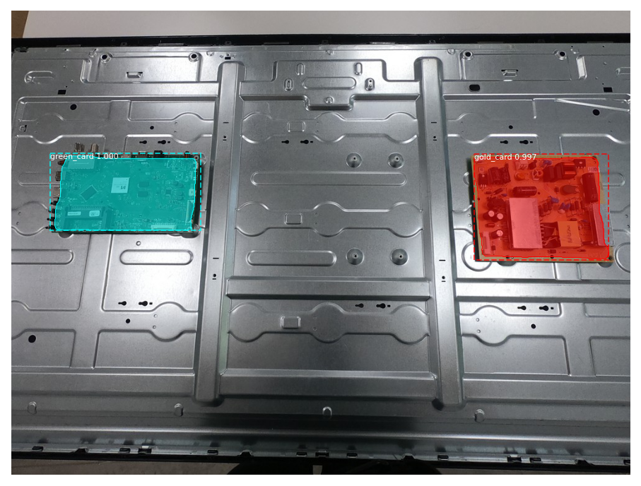

# Mask R-CNN for detection of electronic cards

This repository contains the code that allowed me to train an fine tune a [Mask R-CNN](https://arxiv.org/abs/1703.06870) model in order to detect electronic cards for my project with the MsC AIMove.

It contains two notebooks: 
* train_test_matterport is a google colab notebook in which I loaded datasets, trained models and measured them
* realtime_detection which contains a script allowing "real time" detection on a webcam using opencv, and only runs on local

The python files are from the matterport implementation of Mask [R-CNN](https://github.com/matterport/Mask_RCNN) which I cloned. 

# Datasets

This repository contains data and label of 3 datasets:
* The cards on TV dataset which contains 322 images of cards on a TV
* The cards on box dataset which contains 85 images of cards on a cardboard box
* The mixed cards dataset which contains 170 images, 85 from each other dataset

# Models

The models are too heavy to be on a github repository and were delivered alongside the project.

# Objective and limitations of the project

The objective of the project was to study the use of R-CNN architecture for real time detection of electronic cards.
I chose to use Mask-RCNN. 
With no access to a powerful GPU, I decided to use Google Colab to do all the computations.
